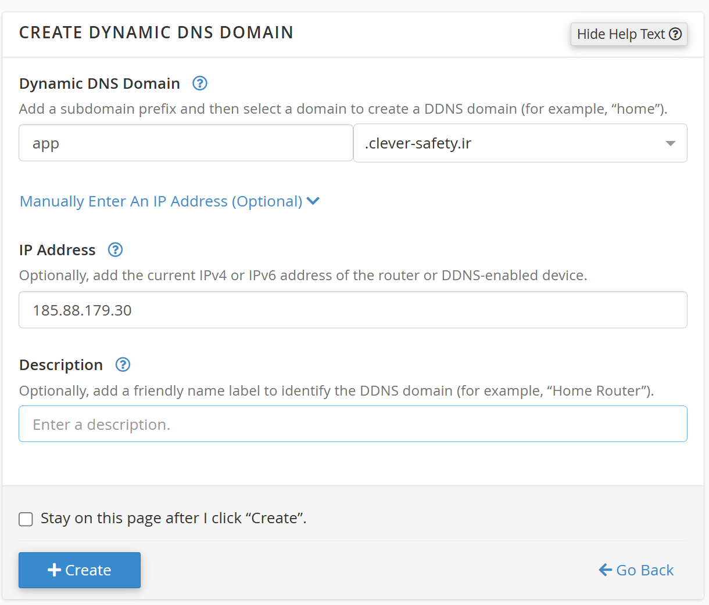

# https-tutorial
در این ریپازیتوری نحوه ایجاد اس اس ال برای وبسایت و زیر دامنه های اپلیکیشن توضیح داده خواهد شد


ابتدا بر روی c-panel خورد رفته و از قسمت Domain بخش Dynamic DNS را انتخاب نمایید و سپس روی create کلیک نمایید.



در قسمت سمت راست نام دامنه خود را انتخاب کنید و در قسمت سمت چپ زیر دامنه ای که قصد انتقال به سرور مجازی خود را دارید وارد کنید.

در نهایت در قسمت IP Address آی پی سرور مجازی خود را وارد کنید و بر روی create کلیک کنید.

تا اینجای کار باعث شدید که یک زیر دامنه از دامنه اصلی شما به سرور مجازی شما انتقال پیدا کند.

حالا زمان تنظیمات nginx رسیده است. از اونجایی که هدف آموزش nginx نیست اگر در فهم مواردی مشکل دارید به آموزش nginx مراجعه کنید.


فایل مربوط به تنظیمات خودتون رو باز کنید و این تنظیمات رو به داخل پورت هشتاد خود اضافه کنید:

```nginx configuration
server {
    listen 80;
    server_name subdomain.domain.com;
    
    location /.well-known/acme-challenge/ {
        root /var/www/domain-name/html;
    }
}
```
وقتی این تنظیمات رو اضافه کردید حالا نیاز هست که certbot رو نصب کنید.


```shell
sudo apt-get update
sudo apt-get install software-properties-common
sudo add-apt-repository ppa:certbot/certbot
sudo apt-get update
sudo apt-get install certbot
sudo apt-get install python3-certbot-nginx
```

پس از نصب تمامی این موارد حالا نوبت این رسیده که از certbot بخوایید برای شما یک اس اس ال بسازه.

```shell
sudo certbot --nginx -d subdomain.domain.com
```

بعد از انجام اینکار مشخصات مورد نیاز به فایل nginx شما اضافه میشه و شما باید اون رو تایید کنید.

بعد از انجام این مراحل اس اس ال شما ساخته میشه و شما میتونید ازش استفاده کنید.

توجه داشته باشید که این اس اس ال به مدت سه ماه معتبر میباشد و بعد از سه ماه مجددا باید اس اس ال شما تمدید بشه. برای انجام تمدید باید از دستور:

```shell
sudo certbot renew --quiet
```

استفاده کنید. با این وجود به نظر میرسه اگر دستی این کارو بکنید فراموش می کنید و سرور شما برای مدت محدودی از کار می افته تا یکی از یوزر های شما گزارش بده که سرویس شما کار نمی کنه و شما هم مجبورید ساعت ها دیباگ کنید که مشکل چیه و در نهایت بفهمید که اس اس ال شما منقضی شده.


بنابراین بیایید با هم تنظیماتی رو انجام بدیم که فرآیند تمدید اس اس ال رو خودش انجام بده.

```shell
sudo crontab -e
```

سپس همون گزینه یک یعنی nano رو انتخاب کنید.

در نهایت این خط رو آخرش اضافه کنید.

```shell
0 2 1 */2 * /usr/bin/certbot renew --quiet
```

که یعنی ساعت دو نصف شب هر دو ماه یک بار این دستور رو برامون اجرا کن.